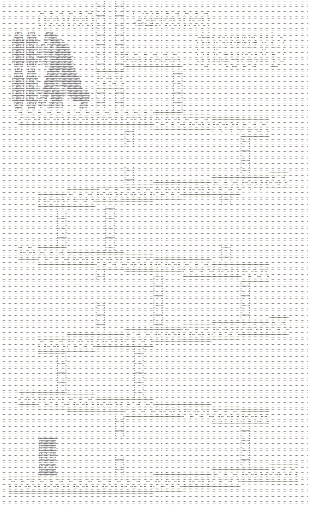

# NESmerize

An NES emulator written in C++.

## To-do

A to-do list, (roughly) in order of priority.

- [x] All 6502 CPU opcodes implemented and working
- [ ] PPU implementation
- [x] iNES memory mapper 0 [NROM]
- [ ] SDL gui
- [ ] PPU scrolling
- [ ] APU support [stretch goal?]
- [ ] memory mappers 1, 2
- [ ] save support

### Code clarity ideas
The code's pretty messy, since I've been prioritizing quantity of quality (at the moment). Here are a few things that I think can make it better.
- [x] enums for addressing modes - especially since they're formulaic
- [x] wrapper functions for things like EOR, AND, ORA, etc. since the only difference is addressing modes
- [x] object organization -> master class for NES object
- [ ] consider passing object / struct as a parameter? instead of function signature changes
- [x] refactor the opcode switch completely [low priority]
- [x] have a instance variable for "extra cycle" flag
- [ ] use a function for detecting upper byte overflow?
- [ ] move enums and initializer lists to separate file

### Current to-dos

Smaller things to work on incrementally - more for me to not forget what I'm working on
- [x] STA always increments cycle in favor of page turn - how to force this?
- [x] unofficial opcodes, starting at LAX
- [x] keep in mind that mapper 0 is hardcoded into current logic (but that's still 250 games)
- [ ] benchmark case-switch and check why it's so fast

### Potential optimizations
- [ ] only update framebuffer for changed tiles in nametable

## Benchmarks
### cpu.cpp

case-switch for all opcodes: ~6 microseconds (fa08c0d)

prebuilt opcode table: ~200 microseconds (8edcb51)

[checked with g++ nes.cpp -std=c++11 -O3 -g -fno-omit-frame-pointer and std::chrono]

- [ ] use latch in memory.cpp to take advantage of quickness of pure case switch and still do memory-mapped i/o (ppu, dma, etc) [maybe]

## Pictures

## Resources

[NES Development Guide](http://nesdev.com/NESDoc.pdf)

[NESTest](http://www.qmtpro.com/~nes/misc/nestest.txt)
